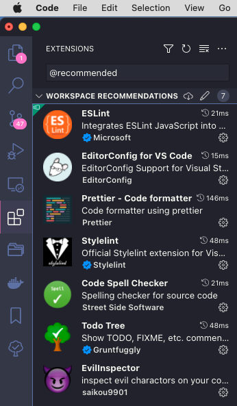

[img-github-release]: https://img.shields.io/github/v/release/TsubasaHiga/Quicint.svg?style=flat-square
[img-npm]: https://img.shields.io/npm/v/quicint.svg?style=flat-square
[img-npm-downloads]: https://img.shields.io/npm/dt/quicint.svg?style=flat-square
[url-github]: https://github.com/TsubasaHiga/Quicint
[url-github-releases]: https://github.com/TsubasaHiga/Quicint/releases
[url-npm]: https://www.npmjs.com/package/quicint
[img-ts]: https://img.shields.io/badge/TypeScript-000.svg?logo=typescript&style=flat-square
[img-sass]: https://img.shields.io/badge/-DartSass-000.svg?logo=sass&style=flat-square
[img-html5]: https://img.shields.io/badge/-HTML5-000.svg?logo=html5&style=flat-square
[img-gulp]: https://img.shields.io/badge/Gulp-000.svg?logo=gulp&style=flat-square
[img-webpack]: https://img.shields.io/badge/-Webpack-000.svg?logo=webpack&style=flat-square
[img-eslint]: https://img.shields.io/badge/-ESLint-000.svg?logo=eslint&style=flat-square
[img-yarn]: https://img.shields.io/badge/-Yarn-000.svg?logo=yarn&style=flat-square
[img-babel]: https://img.shields.io/badge/-babel-000.svg?logo=babel&style=flat-square

# Quicint

<a target="_blank" rel="noopener noreferrer" href="docs/assets/images/logo.png" style="display: block; text-align: center;">
    
</a>

<br>

[![NPM version][img-npm]][url-npm]
[![NPM downloads][img-npm-downloads]][url-npm]

<b>Quick initialize HTML5 EJS Boilerplate（すぐできるHTML5 EJSボイラープレート）</b>

Quicint（クイント）は、テンプレートエンジンにEJSを用いたHTML5サイト構築用のボイラープレートです。
ページの量産が比較的簡単にできるため静的構築プロジェクトでの使用に適しています。

<p style="font-size:13px">Quicint is a boilerplate for building HTML5 sites using EJS as the template engine. It is suitable for use in static building projects as it is relatively easy to mass produce pages.</p>

![ts][img-ts]
![sass][img-sass]
![html5][img-html5]
![gulp][img-gulp]
![webpack][img-webpack]
![eslint][img-eslint]
![yarn][img-yarn]
![babel][img-babel]

## 目次

<!-- TOC -->

- [Quicint](#quicint)
  - [目次](#目次)
  - [動作確認環境](#動作確認環境)
    - [macOS](#macos)
    - [Windows OS](#windows-os)
  - [Setup](#setup)
    - [Install](#install)
    - [VS Code必須プラグインのインストール](#vs-code必須プラグインのインストール)
    - [初期ファイル生成とローカル開発](#初期ファイル生成とローカル開発)
  - [Option](#option)
    - [環境設定](#環境設定)
    - [サイト設定](#サイト設定)
  - [Specification](#specification)
  - [Scripts](#scripts)
    - [Basic](#basic)
    - [Lint](#lint)
  - [Directory](#directory)
  - [Pre-installation Plugin](#pre-installation-plugin)
  - [Supported browser](#supported-browser)
  - [Licence](#licence)

<!-- /TOC -->

## 動作確認環境

### macOS

<details>

``` bash
$ sw_vers
ProductName:    macOS
ProductVersion: 12.0.1
BuildVersion:   21A559

$ node -v
v12.22.9

$ yarn -v
1.22.0
```

</details>

### Windows OS

<details>

``` bash
$ ver
Microsoft Windows [Version 10.0.22000.469]

$ node -v
v12.22.9

$ yarn -v
1.22.17
```

</details>

## Setup

以下の順にセットアップを実施します。

### Install

``` bash
# git clone
git clone https://github.com/TsubasaHiga/Quicint.git your-project

# cd
cd your-project

# install
yarn install
```

### VS Code必須プラグインのインストール

検索欄に`@recommended`を入力すると、ワークスペース内で推奨されるプラグインリストが表示されます。それぞれインストールを行ってください。



### 初期ファイル生成とローカル開発

初期ファイルの生成を行い、その後ローカルサーバーを起動します。
この時点で開発可能になり各種ファイルのWatchタスクが始まります。

``` bash
# Initial file generation
yarn development

# serve
yarn serve
```

## Option

### 環境設定

環境設定は`./setting.json`にて行なえ、主にGulp上の各タスクで利用されます。

<details>
  <summary>詳細を表示する</summary>

``` json
{
  "browsersync": {
    "browser": "google chrome",
    "server": {
      "baseDir": "./dist"
    },
    "notify": false,
    "open": false,
    "ghostMode": {
      "clicks": false,
      "forms": false,
      "scroll": false
    },
    "port": 3000,
    "https": false,
    "reloadOnRestart": true
  },
  "htmlmin": {
    "collapseWhitespace": false,
    "removeComments": false
  },
  "htmlminProduction": {
    "collapseWhitespace": false,
    "removeComments": true
  },
  "htmlbeautify": {
    "indent_size": 2,
    "preserve_newlines": false
  },
  "pngquant": {
    "quality": [0.6, 0.7],
    "speed": 1,
    "floyd": 0
  },
  "mozjpeg": {
    "quality": 75,
    "progressive": true
  },
  "svgo": {
    "removeXMLNS": true,
    "removeDimensions": true,
    "plugins": [
      {
        "removeAttrs": {
          "attrs": "data.*"
        }
      },
      {
        "removeUnknownsAndDefaults": false
      },
      {
        "removeViewBox": false
      }
    ]
  },
  "gifsicle": {
    "optimizationLevel": 3
  },
  "pngquantManual": {
    "quality": [0.8, 0.9],
    "speed": 1,
    "floyd": 0
  },
  "mozjpegManual": {
    "quality": 95,
    "progressive": true
  },
  "gifsicleManual": {
    "optimizationLevel": 3
  },
  "imageManualLists": ["**/*@2x.{png,jpg,gif,svg}"],
  "publishDir": "Desktop",
  "io": {
    "input": {
      "styles": "src/assets/styles/",
      "images": "src/assets/images/",
      "scripts": "src/assets/scripts/",
      "ejs": "src/"
    },
    "output": {
      "styles": "dist/assets/styles/",
      "images": "dist/assets/images/",
      "scripts": "dist/assets/scripts/",
      "html": "dist/"
    },
    "setting": "./setting.json",
    "siteSetting": "./setting-site.json",
    "define": "./define.json"
  }
}
```

</details>

### サイト設定

サイト固有の値を記述するファイルは`./setting-site.json`にて行なえます。
サイト名、metaなどサイト全体で利用する定数などの設置場所として利用可能です。主にEJSで用いられます。

<details>
  <summary>詳細を表示する</summary>

``` json
{
  "siteName": "HTML5案件用のボイラープレートQuicit",
  "siteDomain": "https://example.com",
  "sitePath": "/",
  "metaAuthor": "サンプルテキスト",
  "metaAppid": "0123456789",
  "metaTwitterSite": "サンプルテキスト",
  "metaTwitterCreator": "サンプルテキスト",
  "publishFileName": "Quicint",
  "themeColor": "#000",
  "webFontUrl": "https://fonts.googleapis.com/css2?family=Noto+Sans+JP:wght@400;500;700"
}
```

</details>

## Specification

| item            | detail                                                          |
| --------------- | --------------------------------------------------------------- |
| Node.js         | >= 12.x                                                         |
| Package manager | yarn                                                            |
| Build system    | Gulp v4                                                         |
| Module bundler  | webpack                                                         |
| Scripts         | TypeScript                                                      |
| CSS design      | FLOCSS                                                          |
| Template Engine | EJS                                                             |
| Linter          | eslint & stylelint & ejs-lint                                   |

## Scripts

### Basic

``` bash
# ローカルサーバーの起動と各種ファイルのWatchが可能です。通常はこちらで制作を行います。
yarn serve

# developmentビルドを行います。`dist/`配下に書き出されます。
yarn development

# productionビルドを行います。`dist-production/`配下に書き出されます。
yarn prod

# 各種ファイルをMinifyし.Zipファイルとして指定ディレクトリへ書き出します。書き出しディレクトリはsetting.jsonのpublishDirで指定可能です。
yarn zip

# `src/assets/images/`を正として、再画像圧縮を行います。
yarn resetImg

# `src/**/*.ejs`を正として、再書き出しを行います。
yarn resetEjs
```

### Lint

``` bash
# stylelint
yarn lint:scss

# eslint
yarn lint:ts

# ejs-lint
yarn lint:ejs
```

## Directory

第2階層までの主要ディレクトリ構造（一部省略）です。
`src`ディレクトリが作業ディレクトリになり、`dist`ディレクトリを出力先として利用します。

<details>
  <summary>詳細を表示する</summary>

``` bash
.
├── .husky/
├── dist/
├── docs/
├── gulpfilejs/
├── src
│   ├── @types
│   ├── assets
│   ├── example
│   ├── inc
│   ├── modules
│   └── index.ejs
├── .editorconfig
├── .eslintignore
├── .eslintrc.json
├── .gitignore
├── .ncurc.json
├── .npmrc
├── .prettierignore
├── .prettierrc
├── .stylelintignore
├── .stylelintrc.json
├── LICENSE
├── README.md
├── define.json
├── gulpfile.js
├── package.json
├── setting-site.json
├── setting.json
├── tsconfig.json
├── webpack.common.js
├── webpack.dev.js
├── webpack.prod.js
└── yarn.lock
```

</details>

## Pre-installation Plugin

| Plugin            | Purpose of use                                                                               |
| ----------------- | -------------------------------------------------------------------------------------------- |
| ress              | [ress.css](https://github.com/filipelinhares/ress)                                           |
| object-fit-images | `object-fit`Polyfill                                                                         |
| picturefill       | `<picture>`Polyfill                                                                          |
| sweet-scroll      | [https://github.com/tsuyoshiwada/sweet-scroll](https://github.com/tsuyoshiwada/sweet-scroll) |

## Supported browser

| Browser                | Version            |
| ---------------------- | ------------------ |
| Google Chrome          | latest             |
| Firefox                | latest             |
| Safari(macOS)          | latest             |
| IE11                   | Windows 10 later   |
| Edge(EdgeHTML)         | latest             |
| Edge(Chromium)         | latest             |
| Safari(iOS)            | latest iOS version |
| Google Chrome(Android) | latest             |

## Licence

MIT
